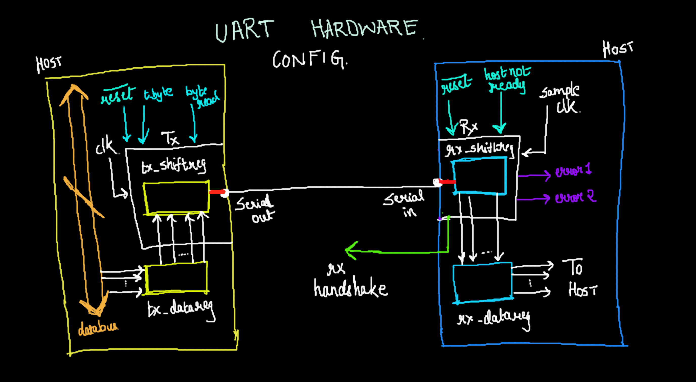

# UART Protocol Verilog Implemetation

## About 

This is a repository for UART protocol's hardware implementation.

Kindly feel free to look around and suggest changes as well.

## Usage

Firstly, you will need `iverilog` or an equivalent tool to verify the working.

To view waveform, kindly use `gtkwave`.

Steps to view the output:

+ Launch terminal and clone the repository into your local machine.
+ `cd` into the directory.
+ Type the following command `iverilog -o uart tb_uart.v uart.v`.
+ Once the above command is executed, run `vvp uart`.
+ This should display the output on the terminal window.
+ To view waveform, run `gtkwave tb_uart.vcd`

## UART Protocol Basics

`UART` stands for **Universal Asynchronous Receiver & Transmitter**. 
The devices in question are capable of transmitting and receiving *serial data*.

In this implementation, we assume that there are two *Host Processors* with a modem each to receive/transmit data.
UART also enables data transmission from both devices, but in this case, for simplicity, we implement only one-way communication.

The reason it is *asynchronous* is because the transmitter and receiver `do not` share a common clock.
Point to note is that both have a separate clock of their own. Their main purpose is to synchronize the loading and shifting of registers.

Now, the next thing we need to know is the format of the data which is to be transmitted.

A data frame always starts with the `start bit`, followed by the byte to be transmitted and then a `stop bit` (`parity bit` is optional). In our implementation, we ignore the `parity bit`. 

## Working of UART Protocol

I would like to keep things as simple as possible. The image below should aid the explanation.

The working in a superficial sense is given below:

+ Host of `Tx` has a `data_bus` having the data to be sent.
+ Data gets shifted into the `tx_datareg` which acts as a buffer. 
+ At the next clock cycle, data gets shifted in parallel into `tx_shiftreg` which then gets shifted out serially through the `serial_out`.

+ Data is received serially by the `serial_in` at the `Rx` and then loaded into `rx_shiftreg`.
+ Point to note is that `Rx` works on it's own `sample_clk` which is approximately **8x** the clock frequency of the `Tx`. 
+ Once the data is sampled, it is loaded onto `rx_datareg` which then is sent to the host.

The catch in the working of UART Hardware is that both `Tx` and `Rx` are **state machines**. The state machine (controller) takes input signals from the `host` and also outputs signals for the efficient working and coordination between `Tx` and `Rx`.

## Ports with meanings

Below are the terminologies used in the figure with their meaning:

### Transmitter

+ `clk`: Clock signal used in Transmitter
+ `reset_`: Asynchronously reset the entire controller
+ `data_bus`: Bus to carry data in the Transmitter's host
+ `t_byte`: Host initiates transmission
+ `byte_ready`: Verify that bus has valid data
+ `tx_datareg`: Register to hold the data
+ `tx_shiftreg`: Shift register to shift the data out serially
+ `serial_out`: Output of the transmitter

### Receiver
  
+  `sample_clk`: Clock signal used in Receiver
+  `serial_in`: Input for Receiver
+  `host_not_ready`: Host asserts that it is not ready to receive the data bits
+  `rx_shiftreg`: Shift register used to shift incoming data towards host
+  `rx_datareg`: Register used to hold the received data by the host
+  `error1`: All data bits sampled but host is not ready
+  `error2`: Asserts if stop bit is missing

## More Info

+ Please visit [UART Transmitter](https://www.youtube.com/watch?v=FCQUKHqp4qY) for detailed explanation on UART Transmitter verilog HDL implementation.
+ *Advanced Digital Design with the Verilog HDL* by **Michael D. Ciletti**
